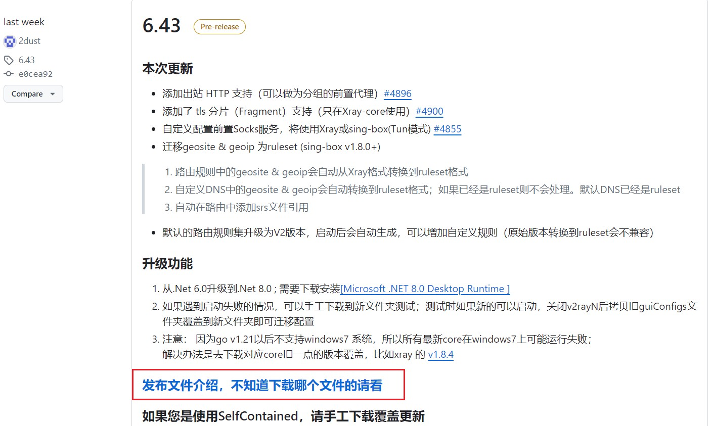
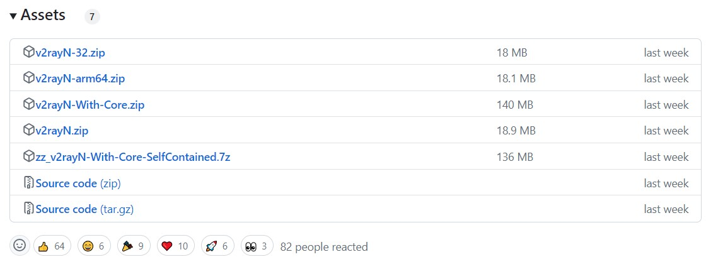
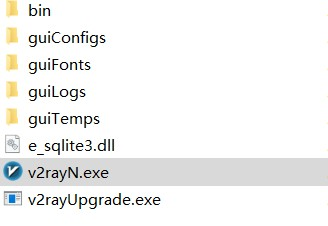
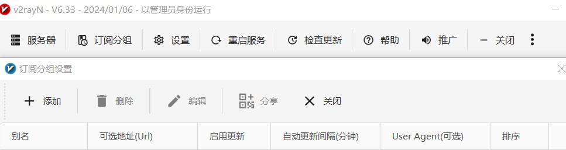
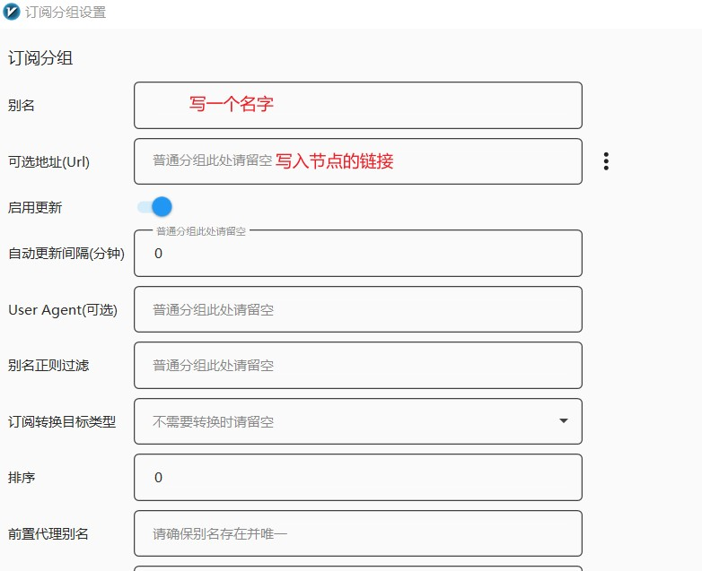
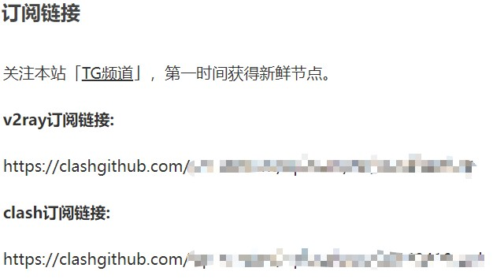
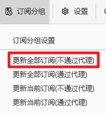
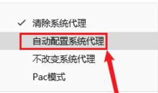
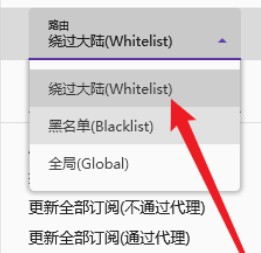

# Download and Usage Tutorial of V2RayN(下载和使用教程)

## Step 1: 下载 V2RayN
Download from this: https://github.com/2dust/v2rayN/releases

And you will see the page like this.

**Attention**

1. It is recommended that new users use the stable version released before downloading.(新手使用建议下载之前发布的稳定版本)
2. If you are using it for the first time, please download the **with-core** type file.(首次使用记得下载**with-core**类型的文件)

Download the appropriate version based on your system and needs.

## Step 2：解压运行程序

单击鼠标右键以**管理员身份运行** v2rayN.exe

## Step 3: 添加、订阅机场（或者自建）节点。

We try to subscribe node for free.

这里选择免费使用节点

进入软件，点击订阅分组

新建订阅，将订阅链接填进去

[免费节点的链接](https://clashgithub.com/category/clashnode)

此外，还可以通过下面的方式批量增加节点，教程详见以下链接 [添加更多的节点](https://github.com/aiboboxx/v2rayfree)

## Step 4: 节点添加完成之后，点击「订阅分组」更新订阅。

## Step 5: 开启系统代理并选择路由模式

**代理**

在任务栏右下角系统托盘找到软件，图标右键，点击**自动配置系统代理**，此时 v2rayN 图标变为**红色**.

测试一下是否可以成功上网 [Google](https://www.google.fr/)

**路由**
v2rayN 路由模式功能是将入站数据按需求由不同的出站连接发出，以达到按需代理，常见用法是分流国内外流量，可以通过内部机制判断不同地区的流量，然后将它们发送到不同的出站代理。当然，也可以自定义路由规则。

- 绕过大陆 (Whitelist) 模式：除中国大陆内网站其它全部通过节点服务器代理上网
- 黑名单 (Blacklist) 模式：仅黑名单内网站通过节点服务器代理上网，其余直连
- 全局 (Global) 模式：所有网站均通过节点服务器代理上网

根据不同的需求选择合适的 v2rayN 路由模式，一般选择**Whitelist**。

## Ending!

**有关V2RayN更多详细教程**

[教程1](https://v2rayn100.com/)

[教程2](https://v2rayn.uuk.app/16)

[教程3](https://didousun.gitbook.io/test-2021/2022-zui-xin-v2rayn-windows-xiang-xi-shi-yong-jiao-cheng)

[系统测时](https://time.is/)

**Free Node**

[free1](https://clashgithub.com/)

[free2](https://github.com/aiboboxx/v2rayfree)

以上是免费使用订阅节点的流程，还可以通过别的方式添加节点，或许存在不足，欢迎一起交流呀！

